# Quantifying Visual Informativeness for AVSR in Noisy Conditions — Project

This folder documents how visual informativeness (MaFI) influences audio-visual speech recognition (AVSR) under noise, using AV-HuBERT. It includes a reproducibility guide, dataset notes, metric definitions, and figure previews exported from the thesis.

---

## Table of Contents
- [1. Overview & Goals](#1-overview--goals)
- [2. Environment](#2-environment)
- [3. Datasets](#3-datasets)
- [4. Model & Inference Setup](#4-model--inference-setup)
- [5. Metrics & Grouping](#5-metrics--grouping)
- [6. Reproduction Guide](#6-reproduction-guide)
- [7. Key Findings](#7-key-findings)
- [8. License & Acknowledgments](#8-license--acknowledgments)

---

## 1. Overview & Goals

**Motivation.** Audio-only ASR performance degrades in noisy conditions. AVSR can leverage visual signals (lip/face motion) to maintain robustness, but we need principled ways to **quantify** how much visuals help and **when** they matter most.

**Goals.**
1. Use **MaFI (Mouth and Facial Informativeness)** to quantify word-level visual clarity/informativeness.
2. Measure word-level recognition errors using **IWER**.
3. Study how the **MaFI–IWER** relationship changes with **SNR** and modality (audio / video / audio+video).
4. Compare different speaker cohorts (e.g., **lip speakers** vs **volunteers**) to understand how articulation clarity translates into AVSR gains.

## 2. Environment

- Python 3.10+
- PyTorch (CUDA if available)
- `fairseq` (as required by AV-HuBERT)
- AV-HuBERT repository & pretrained weights (e.g., `large_noise_pt_noise_ft_433h`)
- Common tools: `numpy`, `pandas`, `scipy`, `scikit-learn`, `matplotlib`

## 3. Datasets

- **LRS2-BBC**: TV/news domain; widely used for AVSR research.
- **LRS3-TED**: TED/TEDx talks; diverse topics and speakers.
- **TCD-TIMIT**: Lab-recorded, 1080p/30fps, with **lip speakers** (professionally trained) and **volunteers**; ideal for controlled comparisons of visual clarity and articulation.

## 4. Model & Inference Setup

**Model.** AV-HuBERT (LARGE). The model follows a self-supervised masked prediction paradigm on audio-visual inputs and supports flexible **modalities** at inference time.

**Typical inference modes**
- `["audio"]` (audio-only)
- `["video"]` (video-only)
- `["audio", "video"]` (audio-visual)

Run three passes to obtain outputs for each modality condition. Save outputs as JSON/TSV with hypotheses, references, and segment IDs.

## 5. Metrics & Grouping
-	**MaFI (Mouth & Facial Informativeness)**:
  A word-level visual informativeness score (higher = more visually informative/easier to lipread). The study partitions words into Low / Medium / High groups using dataset-appropriate thresholds.
- **IWER (Individual Word Error Rate)**:
  Word-level error derived from Levenshtein alignment (typically counting substitutions + deletions; include words that appear ≥ 6 times for stability).
- **Effective SNR Gain**:
  A descriptive measure of how much adding visuals improves recognition relative to an audio-only baseline at a reference SNR.
- **Resampling / Bootstrap**:
  When needed, stratify by MaFI distribution and use bootstrap (fixed random seed) to reduce small-sample and imbalance effects.

## 6. Reproduction Guide
1. Preprocessing
- Build dataset manifests and ensure A/V alignment (e.g., 25 fps or your chosen pipeline).
- If using mouth/face crops, keep the settings consistent with your training/inference configuration.
- Filter low-frequency words and join tokens with MaFI scores.
  
2. Inference (3 passes)
- Generate transcriptions for ["audio"], ["video"], and ["audio","video"].
- Save per-utterance results with IDs to enable word-level alignment.
  
3. Compute IWER
- Perform Levenshtein alignment at the word level.
- Aggregate substitutions + deletions by word type, normalize by word frequency (keep words with count ≥ 6).
  
4. Group by MaFI
- Define Low / Medium / High levels based on three equal-frequency divisions derived from the MaFI database.

  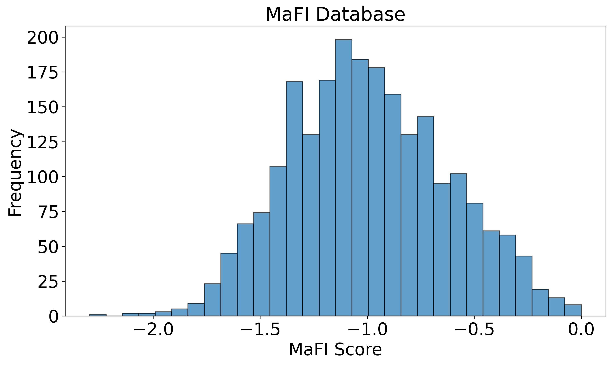
   
  <em>Figure 1. Distribution of MaFI Scores in the MaFI Database</em>

- Ensure each dataset’s MaFI distribution matches the MaFI database distribution, e.g., via resampling so the proportion in each group mirrors the database.

  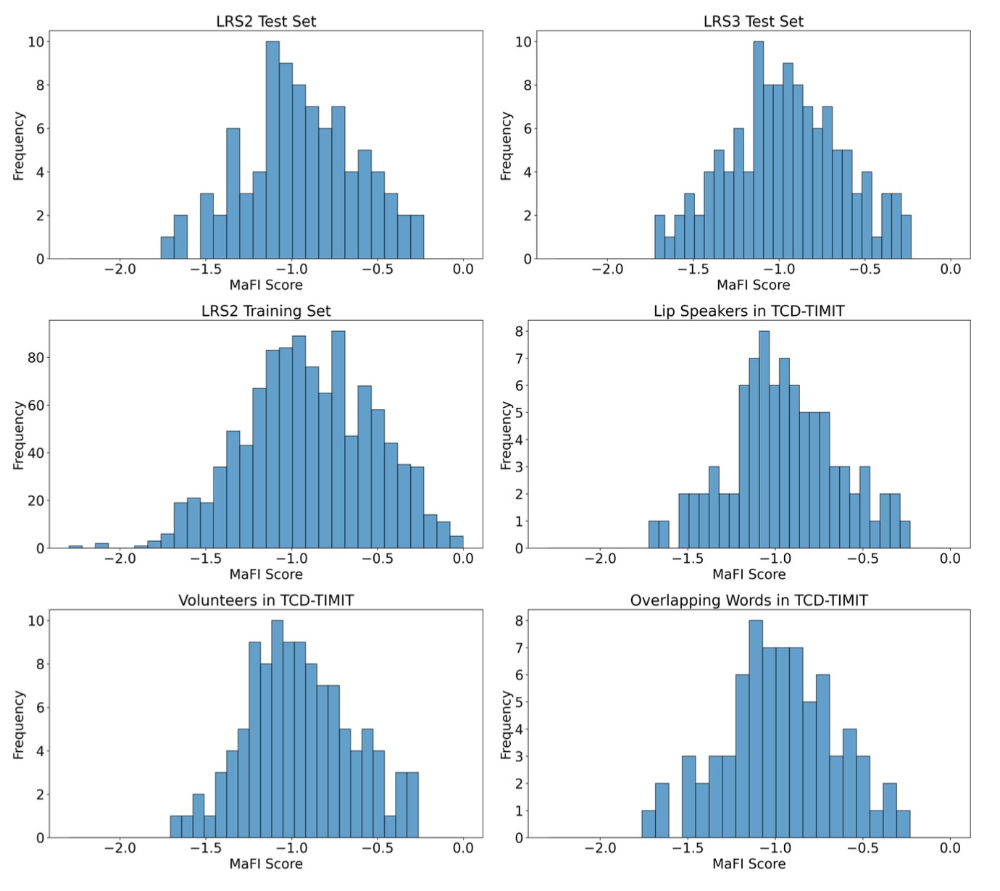
   
  <em>Figure 2. Distribution of MaFI Scores in Resampled Different Dataset (LRS2 Test Set, LRS3 Test Set, LRS2 Training Set, Lip Speakers and Volunteers in TCD-TIMIT, and Overlapping Words Between Lip Speakers and Volunteers in TCD-TIMIT)</em>

  
5. Analysis
- Correlate MaFI vs IWER under different SNRs and modalities
  
  - IWER distribution across MaFI groups

  

    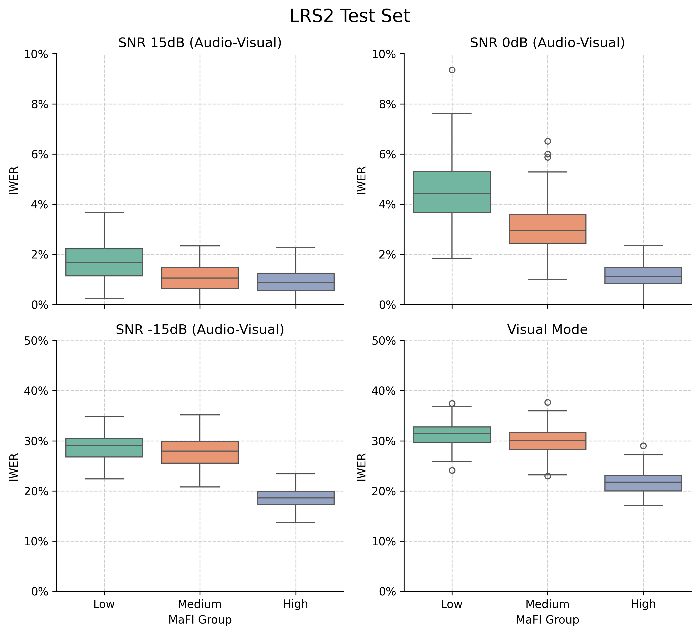
    
    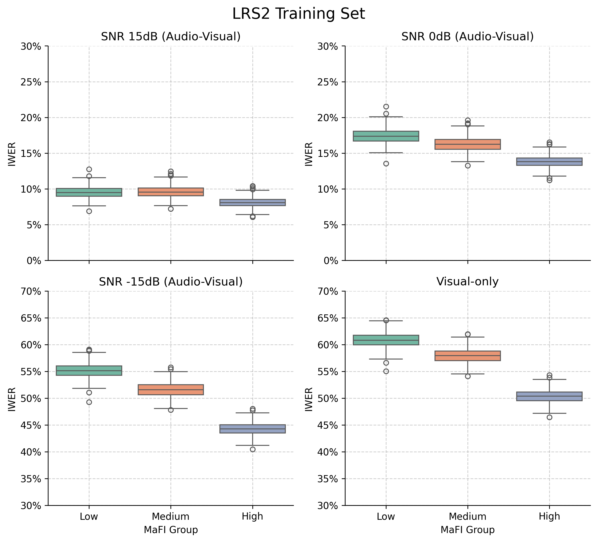
     
    <em>Figure 3. Distribution of IWER across MaFI Groups under SNRs Conditions -15 dB, 0 dB, 15 dB for Audio-Visual Mode and in Visual-Only Mode on LRS2 Test, LRS3 Test, and LRS2 Training Set </em>
  

  - Correlation analysis between MaFI and IWER
  
  

    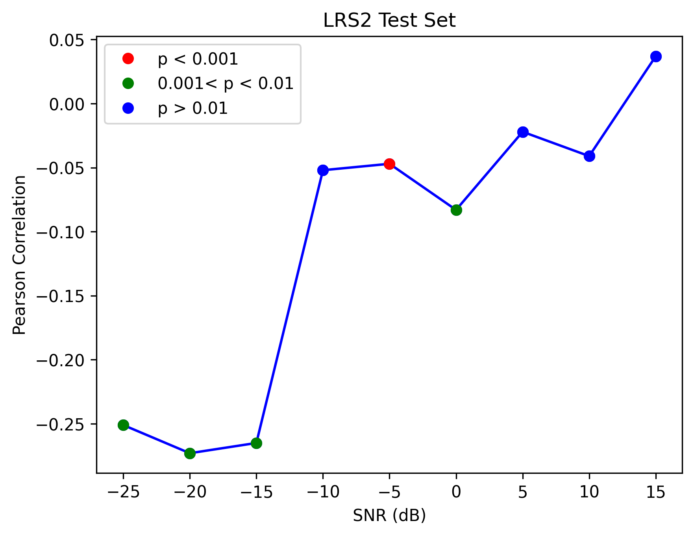
    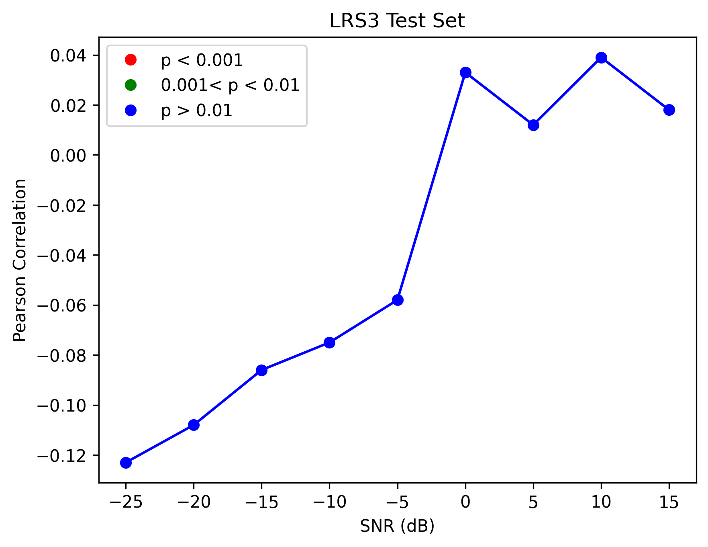
    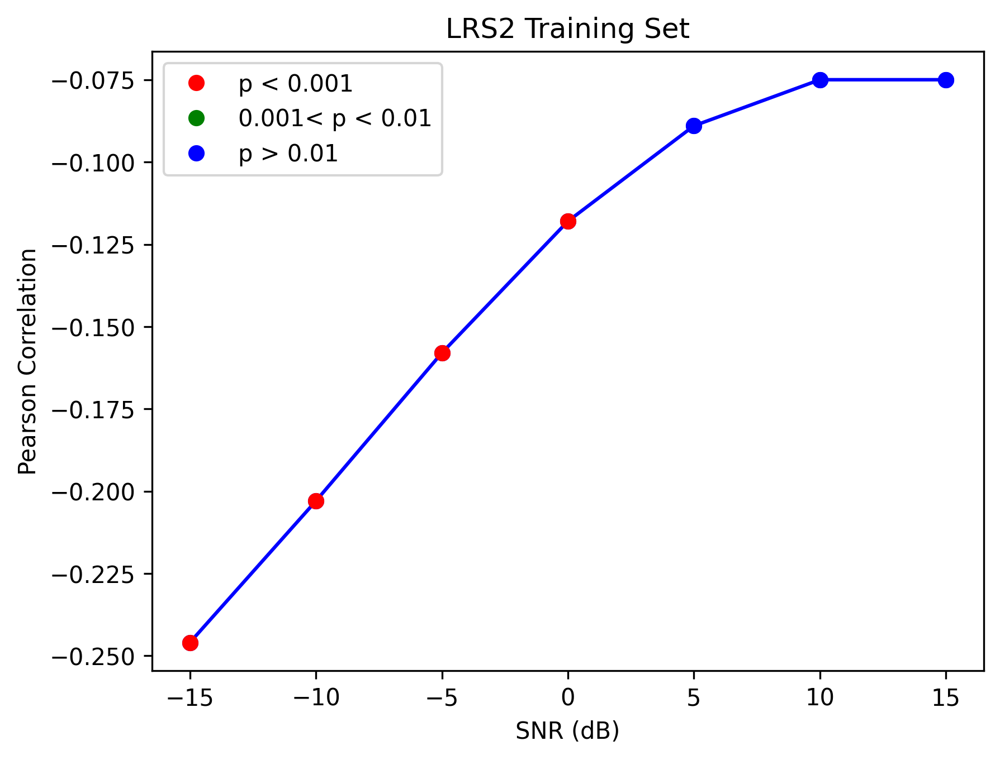
     
    <em>Figure 4. Pearson Correlation between MaFI and IWER in Audio-Visual Mode under Different SNR Levels (Ranging from -25 dB to 15 dB) in LRS2 Test, LRS3 Test, and LRS2 Traning Set </em>
  

- Report effective SNR gains for audio+video vs audio
  

  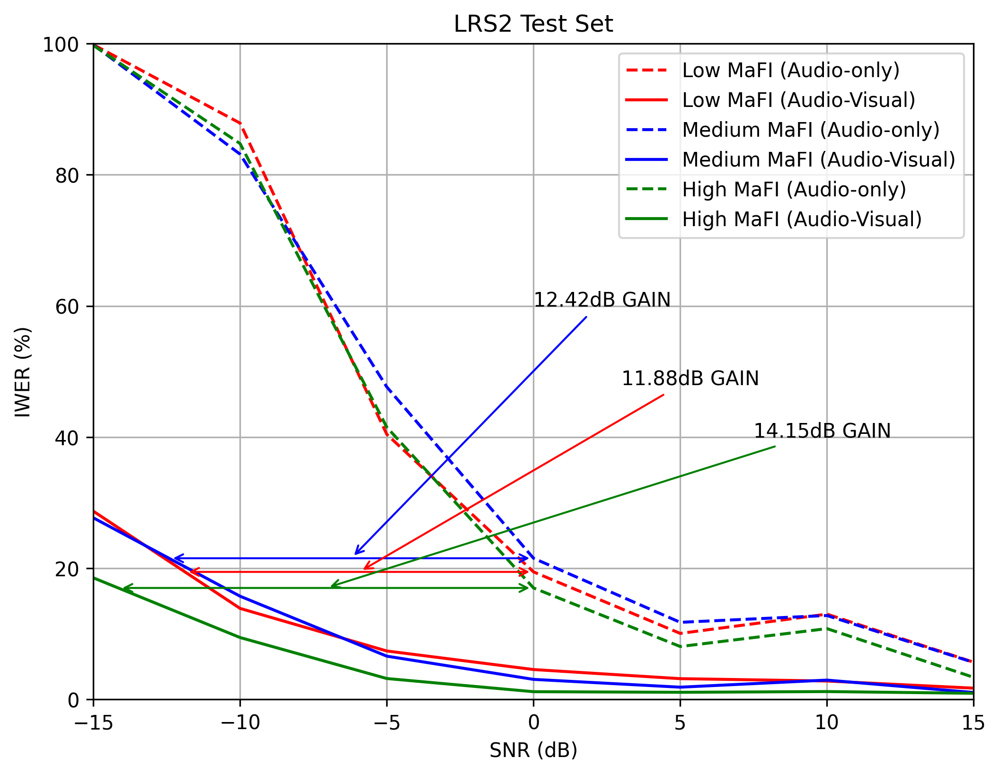
  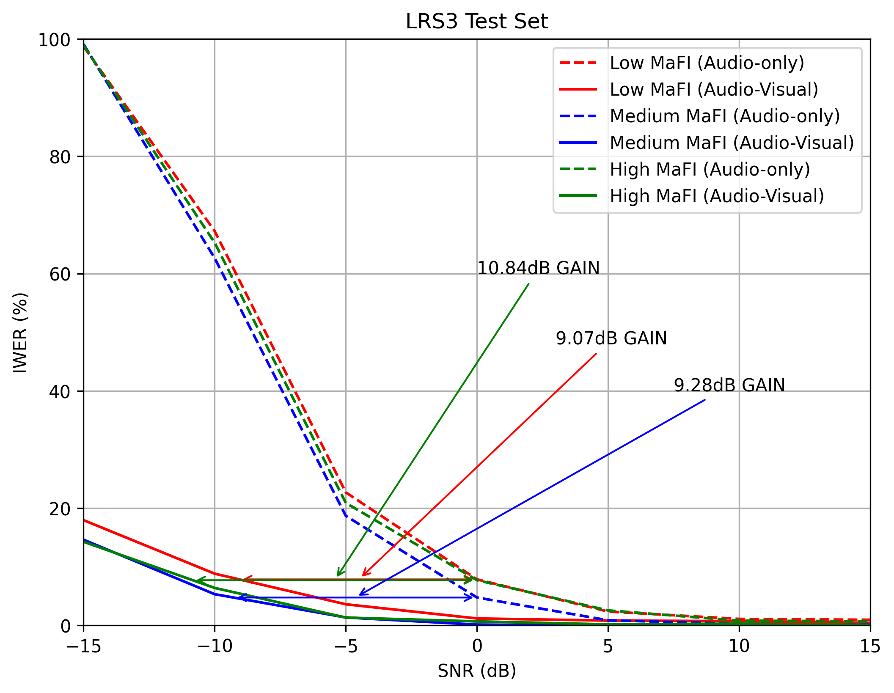
  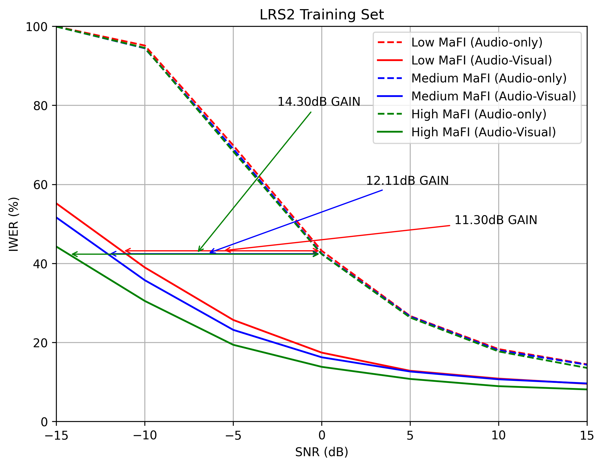
   
  <em>Figure 5. Comparison of Audio-Only and Audio-Visual Modes Performance across MaFI Groups on the LRS2 Test, LRS3 Test, and LRS2 Training Set under Different SNR Conditions (Ranging from -15 dB to 15 dB) </em>

- Optionally, run viseme-level or speaker-cohort analyses (e.g., lip speakers vs volunteers). Here only display viseme-level analyses.

  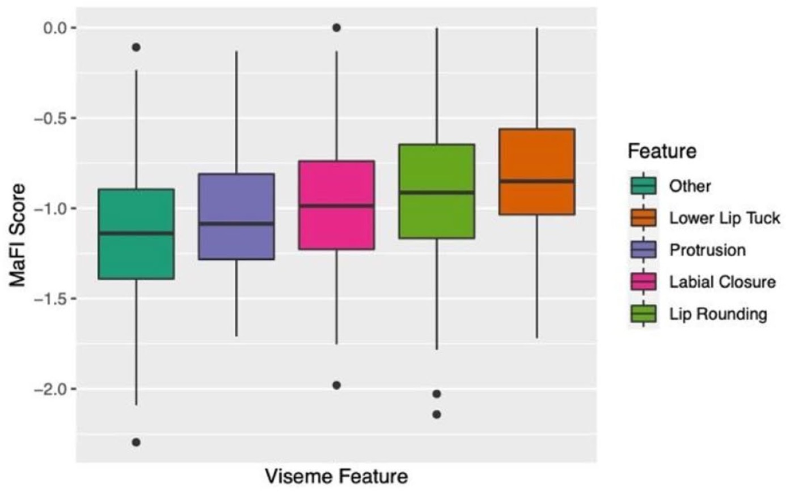
   
  <em>Figure 6. Mean MaFI scores for viseme features. Note: “Other” represents the intercept (i.e., reference level) and refers to all words that do not contain the informative features </em>

  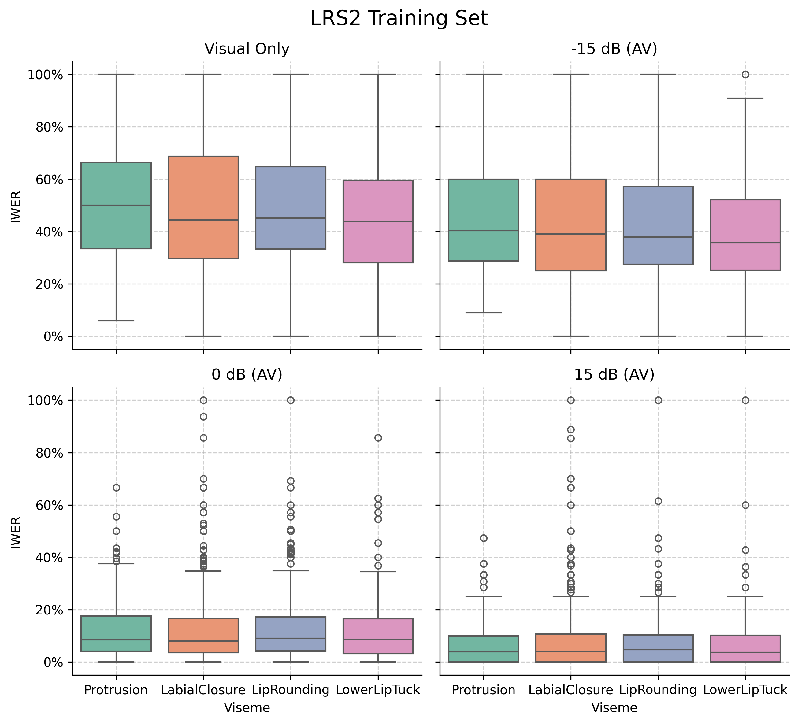
   
  <em>Figure 7. Distribution of IWER Across Different Viseme Groups and Conditions in LRS2 Training Set </em>

  

## 7. Key Findings
- Stronger visuals help more under noise. As SNR decreases, words with higher MaFI tend to have lower IWER, and the negative MaFI–IWER correlation becomes more pronounced.
- Audio-visual synergy depends on MaFI. Effective SNR gains for audio+video over audio-only generally increase from Low to High MaFI groups.
- Speaker articulation matters. Cohorts with clearer articulation (e.g., lip speakers) typically yield better video-only and noisy audio-visual performance than general volunteers.
- Viseme-level trends align with intuitive visual salience: visemes with more distinctive lip movements show lower error under visual reliance.

## 8. License & Acknowledgments
- Code/notes in this folder follow the repository’s main license.
- Figures are exported from the author’s thesis PDF and are provided for non-commercial, academic reproduction and explanation.
- Thanks to the maintainers of AV-HuBERT and the dataset providers (LRS2, LRS3, TCD-TIMIT) that made this work possible.
